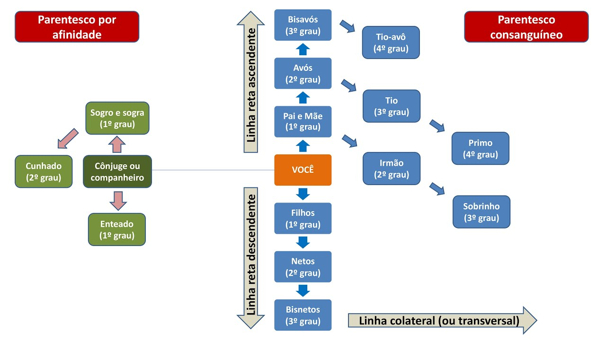

  

---
### **1. Introdução**

Dentro do direito temos as **NORMAS JURÍDICAS:** **Regras e Princípios**.

**Método da subsunção**: Técnica clássica e lógica de aplicação da regra jurídica, operando sob o raciocínio dedutivo formal (premissa maior, premissa menor e conclusão). Ocorre quando o fato concreto se encaixa na hipótese prevista na lei, resultando na aplicação direta da consequência estabelecida, operando na lógica do "**tudo ou nada**".
- **Premissa Maior:** É a norma jurídica formal 
- **Premissa Menor:** É o fato concreto e real ocorrido no mundo físico
- **Conclusão:** Resultado entre a premissa menor(fato) e a premissa maior(norma).

**Método da ponderação/hormonização:** Técnica interpretativa utilizada para solucionar conflitos entre princípios jurídicos no caso concreto. O aplicador do direito avalia o peso de cada princípio na situação específica, buscando equilibrá-los para proteger um valor constitucional com o menor sacrifício possível do princípio contraposto.

**Em relação aos princípios:**
1. Não há princípio absoluto, não há hierarquia entre eles. 
2. Têm força cogente (obrigatórios e imodificáveis). Não são meras recomendações. 
3. Existem princípios expressos e implícitos, mas possuem a mesma importância. 
	

---
### 2. Princípios expressos

A Constituição Federal de 1988 estabelece os cinco princípios basilares da Administração Pública, conhecidos pelo mnemônico **LIMPE**. Esses princípios alcançam toda a administração pública (direta e indireta) e os poderes.

- **Administração Direta**: composta pelos entes políticos (União, Estados, DF e Municípios) e pela estrutura dos seus órgãos internos. Os órgãos que a compõem não possuem personalidade jurídica própria e não têm patrimônio independente.

- **Administração Indireta:** formada por entidades criadas ou autorizadas mediante lei para atuar de forma descentralizada. Essas entidades possuem personalidade jurídica própria (CNPJ), autonomia administrativa e patrimônio independente. 
	- Autarquias, fundações públic, empresas públic e sociedades de economia mista.

#### **2.1 Princípio da Legalidade**

A administração pública age conforme a lei. A lei pode ser Discricionária ou Vinculada.
	**Atos Discricionários**: a legislação concede uma **permissão legal** ao gestor público, criando um espaço para tomada de decisão. 
	**Atos vinculados:** a legislação estabelece uma **obrigação estrita** ou um comando absoluto e inquestionável.

Na esfera privada, vigora a **autonomia da vontade**: o indivíduo é livre para fazer tudo aquilo que a lei não proíba expressamente. Na Administração Pública, vigora a **Legalidade Estrita**: o servidor público só possui autorização para agir quando a lei expressamente determinar ou autorizar. 

#### **2.2 Princípio da Impessoalidade**

**Princípio da Finalidade:** Todo ato administrativo tem um único objetivo: o interesse público. Se um servidor utiliza suas prerrogativas legais para satisfazer interesses privados, ocorre o chamado "**desvio de finalidade**", que torna o ato nulo.
    
1. **Tratamento Isonômico:** A Administração deve aplicar as regras de forma geral.
2. **Vedação de Promoção Pessoal:** A Constituição proíbe que obras, serviços ou campanhas de órgãos contenham nomes, símbolos ou imagens que caracterizem a promoção pessoal ou de partidos políticos. Toda publicidade estatal deve ter caráter **educativo** ou **informativo**. 

**Repercussões práticas do Princípio da Impessoalidade no ordenamento**

1. **Concurso Público:** Materializa a impessoalidade ao garantir que todos os cidadãos tenham oportunidades de acesso ao serviço estatal. A seleção ocorre mediante critérios objetivos, eliminando o favorecimento pessoal.
2. **Licitação:** Procedimento administrativo prévio exigido para que a Administração Pública realize compras, obras ou contratação de serviços. A impessoalidade atua  garantindo a igualdade de condições de disputa entre as empresas privadas. 
3. **Impedimento e Suspeição**: Regras que afastam um agente público da condução, análise ou julgamento de um processo.
	- **Impedimento:** Decorre de situações objetivas e irrefutáveis definidas em lei, como atuar em um processo onde o próprio agente ou parente próximo seja parte.
	- **Suspeição:** Decorre de situações subjetivas, como o agente possuir amizade íntima ou inimizade notória com as partes envolvidas.
4. **Precatórios:** São requisições de pagamento expedidas pelo Poder Judiciário para determinar que os entes públicos quitem dívidas decorrentes de condenações judiciais definitivas. A  impessoalidade reside na obrigatoriedade do pagamento seguir uma ordem, impedindo que o governante escolha quem recebera primeiro.
5. **Imputação Volitiva (Teoria do Órgão):** Os atos praticados por um servidor público no exercício de suas funções são atribuídos ao Estado (ou ao órgão).
#### **2.3 Princípio da Moralidade**

Exige-se que a atuação dos agentes públicos seja pautada pela **ética**, **honestidade**, **probidade**, **lealdade** e **boa-fé.** Um ato pode estar formalmente de acordo com a lei, mas se for praticado com intenções antiéticas, será invalidado pelo Poder Judiciário. 

A **Súmula Vinculante nº 13  do STF** proíbe o Nepotismo na Administração Pública, vedando a nomeação até o terceiro grau para cargos **em comissão ou de função gratificada/de confiança.**

Essa vedação so alcança cargos de natureza administrativa. Não alcança cargos de natureza política.
- Para cargos **Administrativos**, a proibição é absoluta.
- Para cargos **Políticos**, a regra não se aplica automaticamente. O STF permite a nomeação de parentes para esses cargos, salvo se ficar comprovado que o parente não tem nenhuma qualificação técnica para a vaga.

#### **2.4 Princípio da Publicidade**

A publicidade é a regra que garante a transparência da máquina pública, viabilizando o controle social por parte dos cidadãos. A publicidade é o requisito legal de **eficácia** do ato administrativo.

**Eficácia x Validade:** Um ato administrativo já nasce **válido**. A publicação oficial é requisito apenas de **eficácia**. O ato já é válido, mas só começa a produzir efeitos no mundo real depois de ser publicado.

A publicidade não é absoluta, existem atos sigilosos, nas hipóteses de:
1. Segurança da sociedade e do estado.
2. Defesa da intimidade ou interesse social.

**Publicidade x Publicação**: a publicação (divulgação em meio oficial) é apenas uma das várias formas de ter publicidade. Existem atos públicos que não foram publicados em diário oficial.

#### **2.5 Princípio da Eficiência**

Esse foi o único princípio que não constava no texto original da Constituição. A eficiência exige que a Administração Pública atue buscando os melhores resultados possíveis com o menor custo financeiro e de tempo (relação custo-benefício).
- Estágio probatório.
- Contratos de gestão com órgãos e entidades da administração.
- Celeridade(agilidade) dos processos.
- Avaliação das políticas públicas (custo e qualidade)

---

