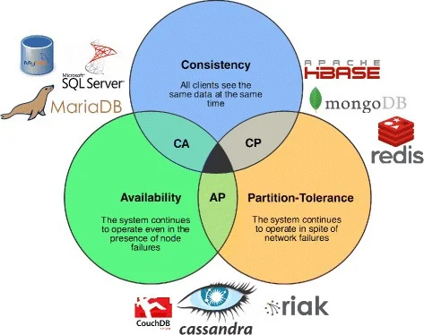

#Concluded 

---

São propriedades essenciais de uma **transação de banco de dados confiável**: Atomicidade, Consistência, Isolamento, Durabilidade. São essenciais para os DB relacionais.
 
Considere essa tabela como exemplo.
```sql
CREATE TABLE Contas (
    ContaID INT PRIMARY KEY,
    Titular VARCHAR(100),
    Saldo DECIMAL(10, 2)
);

INSERT INTO Contas (ContaID, Titular, Saldo) VALUES (1, 'Alice', 1000.00);
INSERT INTO Contas (ContaID, Titular, Saldo) VALUES (2, 'Beto', 500.00);
```

A transação é "transferir 100 da Alice para o Beto". Isso envolve dois comandos: 
1. UPDATE para debitar
2. UPDATE para creditar.

---
### **1. Atomicidade**
Ou todas as operações da transação são concluídas, ou nenhuma delas é.

```sql
BEGIN -- 1. Tenta executar a lógica de negócio
    
    -- Debita da Alice
    UPDATE Contas SET Saldo = Saldo - 100.00 WHERE ContaID = 1;
    -- Credita ao Beto
    UPDATE Contas SET Saldo = Saldo + 100.00 WHERE ContaID = 2;
    
    commit;
    
EXCEPTION
    rollback;
END;

```
O SQL executa tudo dentro do `BEGIN` e, se chegar ao `COMMIT` sem erros, torna as mudanças permanentes.

---
### **2. Consistência**
A consistência garante que o banco de dados só pode ir de um estado válido para outro estado válido. O banco de dados **impõe regras** que você define. Através de `CONSTRAINTS`.

Vamos adicionar uma regra de negócio: "o saldo nunca pode ficar negativo".
```sql
ALTER TABLE Contas 
ADD CONSTRAINT CHK_SaldoPositivo CHECK (Saldo >= 0);
```

Agora, vamos tentar fazer uma transação que viole essa regra.
```sql
BEGIN;
	-- 1. Debitar da Alice (1000 - 1500 = -500)
	UPDATE Contas SET Saldo = Saldo - 1500.00 WHERE ContaID = 1;
	-- ERRO! A CONSTRAINT CHK_SaldoPositivo é violada AQUI.
	-- 2. O comando abaixo nem chega a ser executado
	UPDATE Contas SET Saldo = Saldo + 1500.00 WHERE ContaID = 2;
    commit;
    
EXCEPTION
    rollback;
END;
```

A recomendação arquitetural moderna defende a separação estrita de responsabilidades. O ideal não é a duplicação do código, mas a implementação de camadas complementares de segurança, um conceito conhecido como **Defesa em Profundidade (Defense in Depth).** 

- **O Papel da Camada de Aplicação:** A camada de aplicação deve centralizar a lógica de negócio e as regras de domínio. A validação de dados neste nível impede o envio de requisições inúteis.
	- **Ex:** validar se a idade de um cliente permite a contratação de um serviço específico.
- **O Papel do Banco de Dados:** O banco de dados atua como a última linha de defesa, garantindo a integridade relacional absoluta da informação. 
	- **Ex:** garantir, por meio de uma `FOREIGN KEY`, que um pedido de compra jamais seja associado a um identificador de cliente inexistente.
    
---
### **3. Isolamento**
O isolamento garante que transações concorrentes não interfiram umas nas outras. Imagine que a nossa transferência (Alice -> Beto) está demorando. Ao mesmo tempo, um "Relatório" tenta somar todo o dinheiro do banco.

|     | **Transferência**                                  | **Relatório**                    | **Saldo (Alice/Beto)** | Total |
| --- | -------------------------------------------------- | -------------------------------- | ---------------------- | :---: |
| T1  | `BEGIN TRANSACTION;`                               |                                  | 1000 / 500             | 1500  |
| T2  | `UPDATE Contas SET Saldo = 900 WHERE ContaID = 1;` |                                  | 900 / 500              | 1400  |
| T3  |                                                    | `SELECT SUM(Saldo) FROM Contas;` |                        |       |
| T4  | `UPDATE Contas SET Saldo = 600 WHERE ContaID = 2;` |                                  | 900 / 600              | 1500  |
| T5  | `COMMIT;`                                          |                                  | 900 / 600              | 1500  |
No T3, o que o Relatório deve ler?
- **Sem Isolamento:** O Relatório leria `900 + 500 = 1400`. Ele leria os dados 'meio feitos" da Transação 1. 
- **Com Isolamento:** O banco de dados "trava" as linhas que a Transação 1 está modificando. Quando o Relatório  tenta ler no T3, o banco de dados o faz esperar. Somente após o `COMMIT` no T5 é que o banco libera o lock.

---
### **4. Durabilidade**
A durabilidade garante que, uma vez que a transação recebe o COMMIT, as mudanças são permanentes e sobreviverão a qualquer falha.
1. Você executa: `COMMIT;`. O banco de dados não reescreve imediatamente os arquivos principais da tabela (que são grandes e lentos de modificar).
2. Eapidamente escreve a mudança no arquivo **Transaction Log**, que é muito rápido.
3. Assim que o log é salvo, o banco te responde "OK, comitado!".
4. Processos em segundo plano atualizam os arquivos principais depois
5. **SE O SERVIDOR CAIR!**: Quando o servidor religar, antes de qualquer coisa, ele vai ler o Transaction Log e usá-lo para refazer a operação.

---
### 5. BASE
Para alcançar a alta escalabilidade e o desempenho, a maioria dos bancos NoSQL não tenta aplicar os princípios ACID integralmente. Em vez disso, adotam um modelo alternativo denominado BASE, que relaxa a consistência imediata:
- **Basically Available:** A arquitetura garante que o sistema responderá às requisições, priorizando o funcionamento, mesmo que isso implique retornar dados desatualizados.
- **Soft State:** O estado interno do db pode se alterar ao longo do tempo sem que ocorra uma nova operação de escrita, em virtude do processo de sincronização entre os servidores.
- **Eventual Consistency:** O sistema assegura que, dado um tempo suficiente, todas as cópias da informação distribuídas pela rede convergirão para o mesmo valor atualizado.

O modelo BASE é adotado em sistemas distribuídos globalmente, onde a alta disponibilidade do sistema, a baixa latência de resposta e a capacidade de processamento massivo são prioridades técnicas superiores à consistência imediata da informação.
- Ex: A contagem de curtidas, visualizações de vídeos ou a atualização de linhas do tempo.

---
### 6. Teorema de CAP
O teorema estabelece que é matematicamente impossível para um sistema de armazenamento distribuído garantir simultaneamente as três propriedades a seguir.

- **Consistency:** Todos os nós do sistema devem possuir exatamente os mesmos dados no mesmo instante, impedindo que o cliente receba informações desatualizadas.
    
- **Availability:** Garante que toda requisição válida enviada a um nó operacional receberá uma resposta de processamento sem erro. 

- **Partition Tolerance:** Um particionamento ocorre quando há uma falha na infraestrutura de rede, impedindo temporariamente que os servidores se comuniquem e sincronizem dados entre si. A tolerância a particionamento assegura que o cluster continue a operar e processar requisições mesmo diante da perda de pacotes ou interrupção da comunicação interna.


Em redes físicas, particionamentos são inevitáveis. Portanto, a Tolerância a Particionamento é um requisito obrigatório em sistemas distribuídos. 

- **CP (Consistência e Tolerância a Particionamento):** Quando a rede interna falha, o sistema bloqueia as operações de leitura e escrita nos nós afetados para evitar divergência de dados. A disponibilidade é sacrificada.
	- Dinheiro, transações
- **AP (Disponibilidade e Tolerância a Particionamento):** Quando a rede interna falha, o sistema continua aceitando requisições. O nó consultado retorna a versão dos dados que ele possui armazenada localmente. A consistência é sacrificada para manter o sistema disponível.
	- Número de likes


---


D)


A)

No processamento tradicional, o SGBD alcança essa garantia forçando a gravação física do buffer de log de transações, que reside na memória principal (RAM), diretamente no disco de armazenamento. Apenas após a confirmação da escrita física, o SGBD sinaliza o sucesso para a aplicação.

O recurso de Durabilidade Retardada, implementado em SGBDs modernos, flexibiliza esse fluxo rigoroso. Ao utilizar este modo, o SGBD processa a transação e envia a confirmação de sucesso para a aplicação imediatamente após os dados serem gravados no buffer de log em memória RAM, dispensando a espera pela gravação física no disco.

Contudo, essa configuração introduz um risco arquitetural: caso ocorra uma falha crítica de hardware ou queda de energia antes que os processos assíncronos de retaguarda consigam gravar o conteúdo do buffer no disco físico, as transações que haviam sido reportadas como confirmadas para a aplicação serão perdidas de forma irreversível.


B)