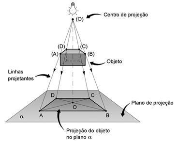

#Concluded 

---
Uma projeção é uma representação bidimensional de um objeto tridimensional. Existem várias técnicas e tipos de projeção. 

**Centro de Projeção:** Ponto no espaço de onde a observação está sendo feita.

**Raio de Projeção:** São linhas imaginárias que saem do Centro de Projeção, viajam pelo espaço, passam pelos vértices do objeto que você está observando e continuam até bater em uma superfície.

**Plano de Projeção:** É a superfície bidimensional onde a imagem final do objeto vai ser "desenhada" quando os Raios de Projeção baterem nela.

### **1. Classificação de projeções**

- **Perspectiva:** Como os raios de luz saem de um ponto único e se espalham em formato de cone, as coisas que estão mais longe parecem menores. É exatamente assim que os nossos olhos e as câmeras fotográficas funcionam.
	
    
- **Paralela:** Pense que a luz foi levada ao infinito, os raios de luz chegam perfeitamente paralelos uns aos outros. Não existe distorção de profundidade. Uma parede de 2 metros lá no fundo terá exatamente o mesmo tamanho no desenho que uma parede de 2 metros colada na tela.

	- **Oblíqua:** A projeção oblíqua é uma projeção paralela que simula profundidade através de raios de projeção inclinados.
	    
	- **Ortográfica:** Aqui, os raios paralelos batem perfeitamente a 90 graus no plano de projeção. Ela preserva medidas e proporções exatas.
	    

---
### **2. Volume de visualização**

O volume de visualização é a região do espaço tridimensional que delimita quais objetos ou partes de objetos serão visíveis na imagem final. Os vértices que se encontram totalmente fora desse volume são descartados por meio de um processo algorítmico chamado de recorte (_clipping_), impedindo o processamento desnecessário de elementos.

- Na projeção em perspectiva, o volume assume o formato de uma pirâmide truncada, onde a área do plano próximo é menor do que a área do plano distante.
		 
- Na projeção ortográfica, ele assume a forma de um paralelepípedo, delimitado por seis planos: esquerdo, direito, inferior, superior, próximo (_near_) e distante (_far_).
    
 - Na projeção obliqua os raios de projeção permanecem paralelos entre si, porém intercedem o plano de projeção em um ângulo diferente de 90 graus. Forma geométrica de um paralelepípedo oblíquo.
	

