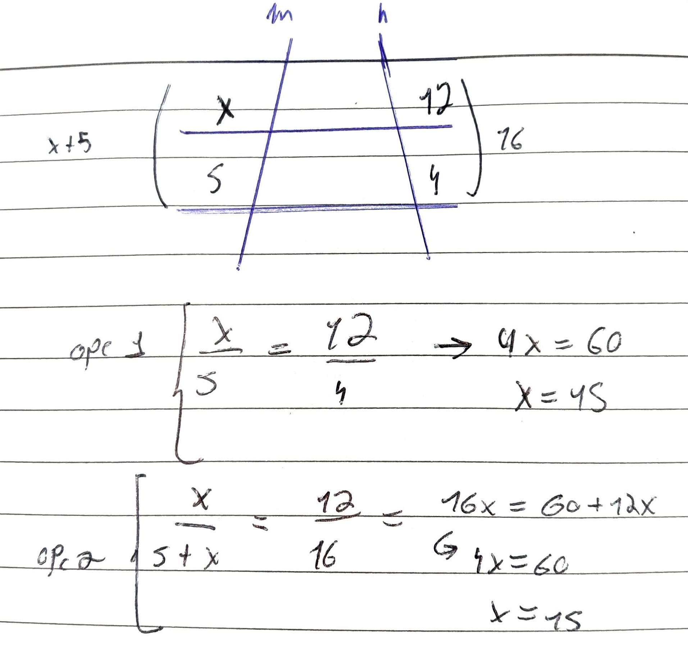

#Concluded 

---

O teorema de tales postula que a intersecção de um feixe de retas paralelas por duas retas transversais determina segmentos de reta proporcionais entre si.

Pense em duas retas transversais se cruzam em um único ponto (formando um vértice). Ao traçar linhas paralelas cortando essas duas transversais que partem da origem, formam-se múltiplos triângulos que compartilham o mesmo ângulo interno no vértice, divergindo apenas em sua escala.

- Se um triângulo maior possui uma altura $H$ e uma base $B$, e um triângulo menor embutido neste possui uma altura $h$ e uma base $b$, a igualdade algébrica é definida por:    $$\frac{h}{H} = \frac{b}{B}$$