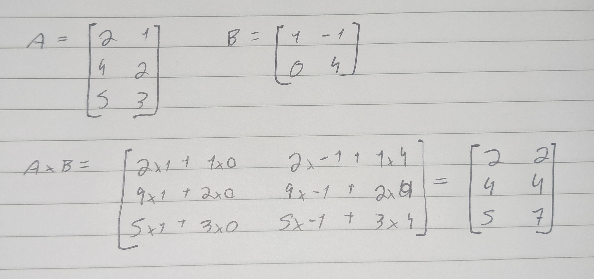

#Concluded 

---
 
 #### **1. Soma de matrizes**

É a soma das entradas correspondentes de A e B.

---

 #### **2. Multiplicação por escalar**

---
#### **3. Transposição**

A transposta de A é a matriz $A^T$ cujas linhas são as colunas de A.

---
### 4. Produto de matrizes
So podemos efetuar o produto de duas matrizes $Am*n$ e $Bp*q$ se n = p.

Sejam B e C matrizes:
1. $A*I = A$
2. $A*(B+C) = A*B+A*C$
3. $(AB)C = A(BC)$
4. $(AB)^T = B^T A^T$
5. $0*A = 0$
6. $AB \neq BA$
 

