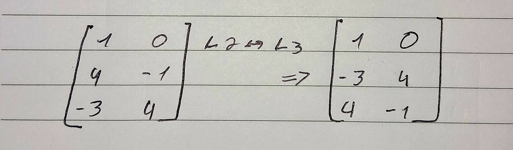
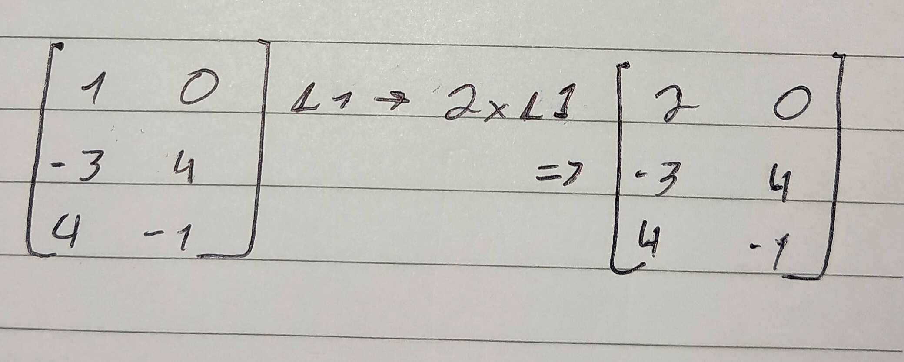
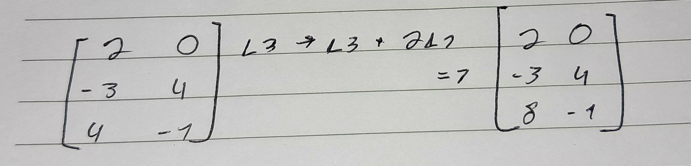

#Concluded 

---
### **1. Sistemas de equações lineares**

Uma equação é classificada como linear quando todos os seus termos são somas de variáveis de primeiro grau, multiplicadas por constantes.

Sistemas de equações lineares com $m$ equações e $n$ incognitas é um conjunto de equaçoes da forma: 

Podemos escrever os sistemas na **forma matricial**:

A junção da **matriz dos coeficinetes** com a dos **termos independentes** é chamada de **matriz ampliada do sistema**.

.jpg)

---
### 2. Operações elementares sobre matrizes

1. Permutação de linhas. 
	

2. Multiplicação de uma liha por um escalar K não nulo.
	

3.  Substituição da i-esima linha pela i-esima linha + k vezes a j-esima linha.
