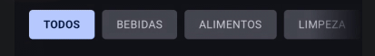

#Concluded 

--- 
Existem basicamente 3 layouts em jetpack componentes: Column, row and box. Como o Compose não sabe onde colocar os elementos por padrão, você usa esses três "containers" para organizar o layout.

---
### **1. Row**

Recebe como parâmetros:
- **modifier**
- **verticalAlignment**: Controla o posicionamento no Eixo Secundário.
- **horizontalArrangement**

---
### **2 Column**

Ele recebe como parâmetros:
- **modifier**
- **horizontalAlignment**: Controla o posicionamento no Eixo secundário.
- **verticalArrangement**: Controla o posicionamento no Eixo Principal.

---
### **3. Box** 

Contêiner responsável pelo alinhamento no Eixo Z (profundidade). Ele é utilizado para sobrepor elementos visuais. A renderização ocorre na exata ordem de declaração no código-fonte.

Parâmetros principais:
- **modifier**
- **contentAlignment**: Controla o posicionamento padrão de todos os elementos contidos no contêiner (por exemplo, centralizado, no canto inferior direito, etc.).

Modificadores exclusivos para os elementos filhos de um Box:
- **align()**: Permite que um componente filho específico ignore e sobrescreva o alinhamento geral definido pelo parâmetro `contentAlignment` do pai.
- **matchParentSize()**: Instrui o componente filho a igualar suas dimensões ao tamanho do Box pai, mas somente após o pai ter seu tamanho final definido pelos outros elementos do layout. 

Um Box principal foi declarado para agrupar dois componentes distintos. A LazyRow foi o primeiro elemento declarado, estabelecendo-se na camada inferior. Logo após, um Box responsável por aplicar o gradiente de cor. 

A utilização da instrução matchParentSize() garantiu que a máscara possuísse exatamente a mesma altura e largura da LazyRow.

**Surface**: O Surface é um contêiner focado exclusivamente na aplicação de propriedades físicas e visuais.

Parâmetros principais:
- **color**: Estabelece a cor de fundo da superfície do contêiner.
- **contentColor**: Configura a cor base padronizada para componentes de tipografia (Text e Icon). Este comportamento visa garantir um nível de contraste e legibilidade adequados em relação à cor de fundo.
- **shape**: Define a forma geométrica do contêiner, permitindo a aplicação de bordas específicas, como cantos arredondados. 
- **shadowElevation / tonalElevation**: Adicionam propriedades físicas de elevação ao componente, gerando projeções de sombras ou ajustando a opacidade da cor para destacá-lo no eixo de profundidade.