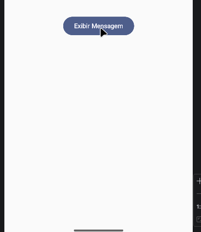
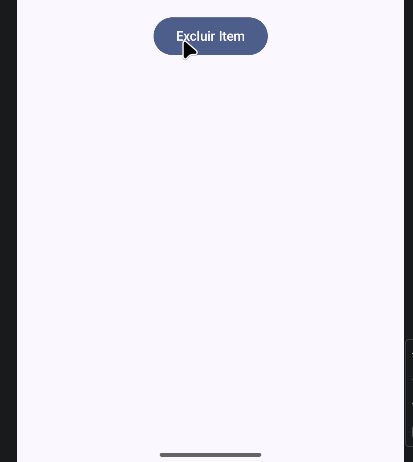

#Concluded 

---
A ferramenta toast fornece feedbacks rápidos e não intrusivos ao usuário. O Toast aparece como um pequeno pop-up que não interrompe a interação com a tela e desaparece automaticamente após alguns segundos.

- **Exemplos:** "E-mail enviado", "Download concluído" ou "Item salvo nos favoritos".

Para criar um Toast, utiliza-se o método estático makeText. Ele exige três parâmetros obrigatórios:
- **Context:** Define em qual parte da aplicação o Toast está operando. 
- **Text:** A String que será exibida para o usuário.
- **Duration:** Define por quanto tempo a mensagem ficará na tela. 
    - Toast.LENGTH_SHORT: Exibição por cerca de 2 segundos.
    - Toast.LENGTH_LONG: Exibição por cerca de 3.5 segundos.

---
### **2. Snackbar**

Snackbar é um componente de interface do Android que fornece mensagens informativas na parte inferior da tela, permitindo interações rápidas através de botões de ação. Diferente do Toast, o Snackbar pode ser fechado pelo usuário e pode conter uma ação (como "Desfazer" ou "Ver"). 

Para exibir um Snackbar, o Compose utiliza quatro elementos trabalhando em conjunto:
- **Scaffold:** O layout mestre que define a estrutura visual.
- **SnackbarHost:** O componente responsável por "hospedar" a mensagem, controlando onde ela aparece e as animações.
- **SnackbarHostState:** O objeto que gerencia o estado.
- **CoroutineScope:** Necessário porque a função de exibir o Snackbar é "suspensa" (executada de forma assíncrona).

