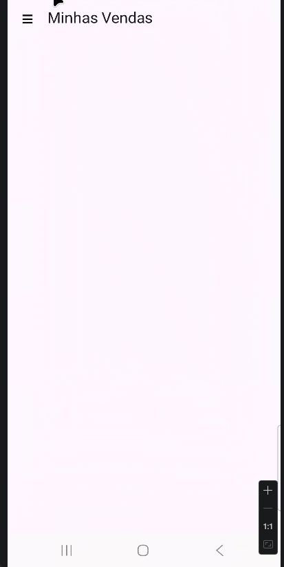

#Concluded 

---

- **rememberDrawerState**: Cria um objeto de estado que persiste durante as recomposições da tela. 
- **rememberCoroutineScope()**: Cria um escopo vinculado ao ciclo de vida da UI. Isso é obrigatório porque abrir ou fechar o menu é uma animação que precisa rodar em uma linha de execução separada para não travar a interface.
- **ModalNavigationDrawer**: É o container de nível superior que gerencia a sobreposição. 
- **drawerContent**: Define o que será desenhado dentro da aba lateral.
- **ModalDrawerSheet**: Define a superfície visual da aba. 
- O comando **scope.launch { drawerState.open() }** é o gatilho que dispara a animação de abertura.    

