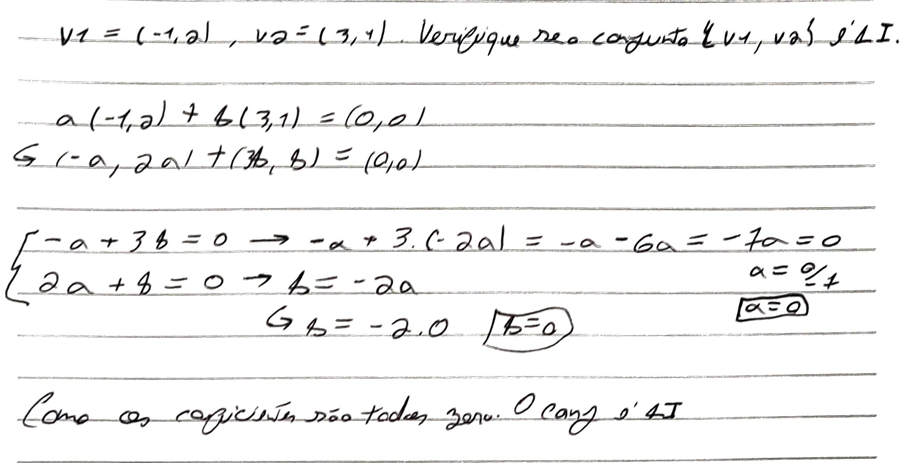

#Concluded 

---

Um conjunto de vetores é **Linearmente independendte (LI)** quando nenhum vetor pode ser formado a partir dos outros. 
 
A única forma de a combinação linear $a_1v_1 + a_2v_2 + \dots + a_nv_n = (0,0)$ resultar no vetor nulo é se **todos** os coeficientes forem zero.

- Caso pelo menos um dos coeficientes fosse difenrete de zero, o conjunto seria **linearmente dependente (LD)**