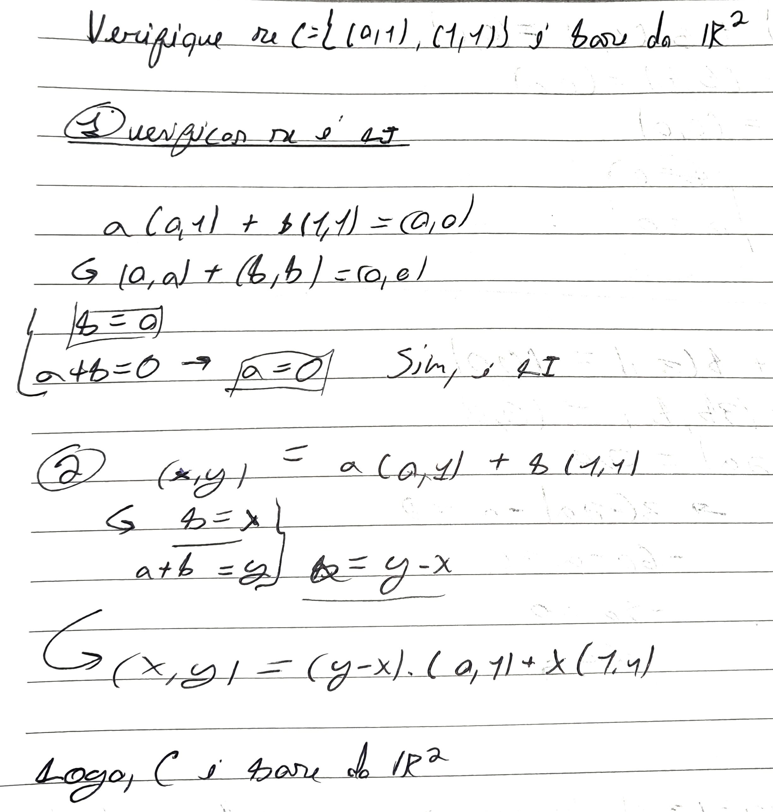
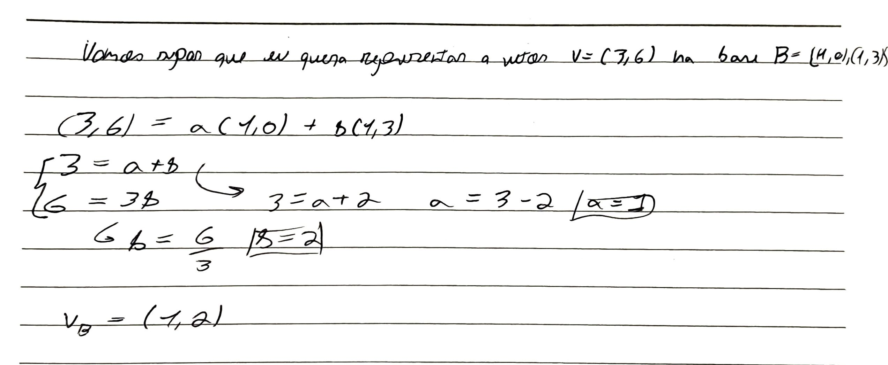
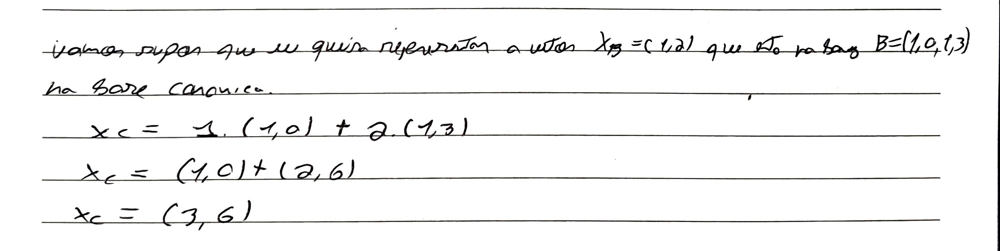

#Concluded 

---
### **1. Base**

Para um conjunto de vetores ser considerado uma base de um espaço $V$, ele precisa obrigatoriamente cumprir duas condições:
1. Tem que serem **linearmente independentes.**
2. Combinando esses vetores, você deve ser capaz de alcançar qualquer ponto dentro do espaço vetorial $V$.

1. **A Base Canônica (World Space):** O mundo padrão que usamos tem os eixos perpendiculares usuais. $\hat{i} = (1, 0, 0)$, $\hat{j} = (0, 1, 0)$, $\hat{k} = (0, 0, 1)$.
2. **Uma Base Arbitrária (Local Space):** base local de um objeto.

3. **Espaço do Objeto:** O artista modela um objeto com o centro dela no $(0,0,0)$.
4. **World Space:** A cadeira é colocada na cena no ponto $(10, 0, 5)$ e rotacionada. Fazemos uma mudança de base para saber onde os vértices da cadeira estão no mundo.
5. **View Space:** O mundo inteiro é recalculado de forma que a câmera se torne a nova origem $(0,0,0)$, olhando diretamente para o eixo $-Z$.

Seja um novo sistema de coordenadas definido por uma origem $O$ e três vetores ortonormais (unitários e perpendiculares entre si) $\vec{u}$, $\vec{v}$ e $\vec{w}$.

A matriz de transformação que converte um ponto do espaço local para o espaço global é:
$$M_{Local \rightarrow Mundo} = \begin{bmatrix} u_x & v_x & w_x & O_x \\ u_y & v_y & w_y & O_y \\ u_z & v_z & w_z & O_z \\ 0 & 0 & 0 & 1 \end{bmatrix}$$
- **Coluna 1:** Para onde aponta o eixo $X$ do objeto.
- **Coluna 2:** Para onde aponta o eixo $Y$ do objeto.
- **Coluna 3:** Para onde aponta o eixo $Z$ do objeto.
- **Coluna 4:** Onde está a origem do objeto no mundo (Translação).

#### E para fazer o caminho inverso? (O View Space)

Muitas vezes, temos um ponto no mundo (ex: um inimigo) e queremos saber onde ele está em relação ao jogador (espaço local do jogador). Precisamos da **matriz inversa**.

Como geralmente usamos bases ortonormais em CG (rotações puras), a inversa da matriz de rotação é simplesmente a sua **transposta** (trocar linhas por colunas).

$$M_{Mundo \rightarrow Local} = \begin{bmatrix} u_x & u_y & u_z & -\vec{u} \cdot O \\ v_x & v_y & v_z & -\vec{v} \cdot O \\ w_x & w_y & w_z & -\vec{w} \cdot O \\ 0 & 0 & 0 & 1 \end{bmatrix}$$

_(A função `gluLookAt` do OpenGL constrói exatamente essa matriz!)_

---

---
### 2. Mudança de base

A mudança de base é o processo de converter as coordenadas de um vetor de um sistema de referência para outro.

- A **Base Canônica** no $\mathbb{R}^2$ é formada por $(1, 0) ,(0, 1)$.
- Mas você pode inventar outra base $\beta = \{v_1, v_2\}$ qualquer.

**Mudança de vetor da conônica para nova base**

**Mudança de base para a canônica**

Considere duas bases no $\mathbb{R}^2$:
- **Base Canônica ($\epsilon$):** $e_1 = (1, 0), e_2 = (0, 1)$
- **Base Qualquer ($\beta$):** $v_1 = (1, 2), v_2 = (3, 4)$
    

**De uma Base $\beta$ para a Canônica $\epsilon$**
Monte a matriz $M$ colocando os vetores de $\beta$ nas **colunas**.
$$M = \begin{bmatrix} v_{1x} & v_{2x} \\ v_{1y} & v_{2y} \end{bmatrix}$$

$$[v]_\epsilon = M \cdot [v]_\beta$$

**Da Canônica $\epsilon$ para uma Base $\beta$**

$$[v]_\beta = M^{-1} \cdot [v]_\epsilon$$

---

### **3. Base ortonormal

Para que um conjunto de vetores (como uma base de um espaço vetorial) seja considerado ortonormal, ele deve satisfazer simultaneamente duas condições: a **ortogonalidade** e a **normalidade**.

**Ortogonalidade**: Dizemos que dois vetores são ortogonais quando o produto escalar entre eles é igual a zero. Isso significa que eles são perpendiculares entre si, formando um ângulo de 90°.

**Normalidade**: Um vetor é considerado "normal"quando o seu comprimento é exatamente igual a 1. 
- Para um vetor $\vec{u}$ ser normal, o produto escalar dele por ele mesmo deve ser 1, pois:
$$\vec{u} \cdot \vec{u} = \|\vec{u}\|^2 = 1^2 = 1$$

