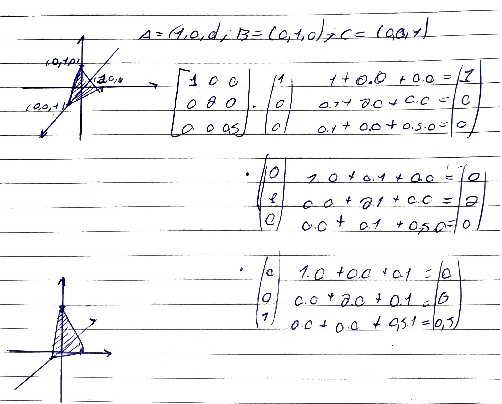
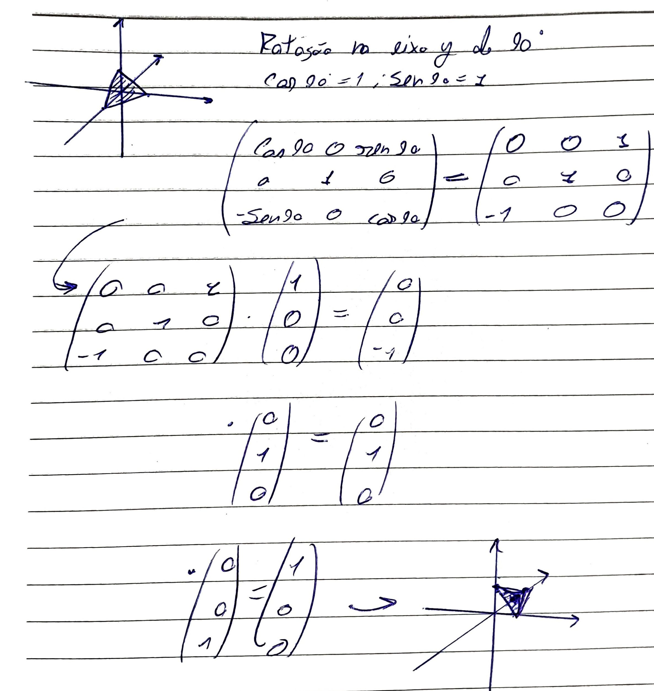

#Concluded 

---
As transformações lineares em 3D são funções matemáticas que mapeiam um vetor de entrada $(x, y, z)$ para um novo vetor de saída $(x', y', z')$.

Toda transformação linear pode ser representada por uma **Matriz de Transformação**. Em 3D, usamos matrizes $3 \times 3$ (ou $4 \times 4$ para coordenadas homogêneas).

### **1. Translatar**

Transladar um ponto significa somar um deslocamento: $x' = x + t_x$. As outras transformações (escala, rotação, cisalhamento) são multiplicações. Se você mantiver o 3D puro, não consegue combinar o movimento com o giro em uma única matriz. Você teria que multiplicar para girar e depois somar para mover, o que impede a otimização em massa que as GPUs fazem.

Para transformar a soma em uma multiplicação, "fingimos" que o nosso mundo 3D existe dentro de um espaço 4D. 

Agora que a translação é uma matriz $4 \times 4$, você pode fazer isso aqui no seu código:

$$M_{final} = M_{translacao} \cdot M_{rotacao} \cdot M_{escala}$$
O resultado é uma única matriz $4 \times 4$ que, ao ser multiplicada por um ponto, muda o tamanho, gira e move o objeto para o lugar certo de uma vez só 

**E para retornar ao valor anterior?**
Para retornar um ponto transformado ($P_{novo}$) ao seu estado original ($P_{original}$), você precisa multiplicar este ponto pela matriz inversa da transformação denotada como $M_{final}^{-1}$.

Se a sua matriz final é definida por $M_{final} = M_{translacao} \cdot M_{rotacao} \cdot M_{escala}$, a matriz inversa composta será:
$$M_{final}^{-1} = M_{escala}^{-1} \cdot M_{rotacao}^{-1} \cdot M_{translacao}^{-1}$$

**Inversa da Matriz de Translação**
	Matriz Original ($T$):
$$T = \begin{bmatrix} 1 & 0 & 0 & t_x \\ 0 & 1 & 0 & t_y \\ 0 & 0 & 1 & t_z \\ 0 & 0 & 0 & 1 \end{bmatrix}$$
	Matriz Inversa ($T^{-1}$):
$$T^{-1} = \begin{bmatrix} 1 & 0 & 0 & -t_x \\ 0 & 1 & 0 & -t_y \\ 0 & 0 & 1 & -t_z \\ 0 & 0 & 0 & 1 \end{bmatrix}$$

**Inversa da Matriz de Escala**
	Matriz Original ($S$):
$$S = \begin{bmatrix} S_x & 0 & 0 & 0 \\ 0 & S_y & 0 & 0 \\ 0 & 0 & S_z & 0 \\ 0 & 0 & 0 & 1 \end{bmatrix}$$
	Matriz Inversa ($S^{-1}$):
$$S^{-1} = \begin{bmatrix} \frac{1}{S_x} & 0 & 0 & 0 \\ 0 & \frac{1}{S_y} & 0 & 0 \\ 0 & 0 & \frac{1}{S_z} & 0 \\ 0 & 0 & 0 & 1 \end{bmatrix}$$
Se um objeto foi escalonado por um fator de $2$, sua inversa exige um escalonamento pelo fator de $1/2$.

**Inversa da Matriz de Rotação**
	Matriz Original ($R$):
$$R = \begin{bmatrix} r_{11} & r_{12} & r_{13} \\ r_{21} & r_{22} & r_{23} \\ r_{31} & r_{32} & r_{33} \end{bmatrix}$$
	Matriz Inversa ($R^{-1} = R^T$):

$$R^{-1} = \begin{bmatrix} r_{11} & r_{21} & r_{31} \\ r_{12} & r_{22} & r_{32} \\ r_{13} & r_{23} & r_{33} \end{bmatrix}$$
As matrizes que representam rotações tridimensionais puras pertencem a uma classe especial na álgebra linear chamada de matrizes ortogonais. A propriedade definidora de uma matriz ortogonal é que seus vetores coluna (e vetores linha) são ortonormais: eles têm comprimento igual a $1$ e são perpendiculares entre si. O teorema fundamental das matrizes ortogonais estabelece que a inversa de uma matriz ortogonal é exatamente igual à sua matriz transposta.

---
### **2. Escala**

A escala altera o tamanho do objeto. Ela multiplica cada componente do vetor por um fator de escala $s$.

- Se $s_x = 2$, o objeto dobra de largura. Se for $0.5$, ele reduz pela metade. Se os fatores forem diferentes, você "estica" o objeto em direções específicas.
	

---
### **3. Rotação**

No espaço bidimensional, a rotação ocorre inteiramente dentro de um único plano (o plano $xy$) e sempre em torno de um único ponto (normalmente a origem). Devido a essa restrição geométrica, existe apenas uma matriz de rotação fundamental.

Rotação no eixo Z

 

---
### **4. Reflexão**

A reflexão inverte o objeto em relação a um plano (como um espelho).

---
### **5. Cisalhamento**

Existem 6 matrizes de cisalhemento 3D:

