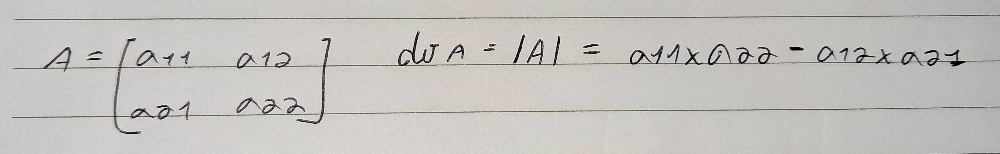
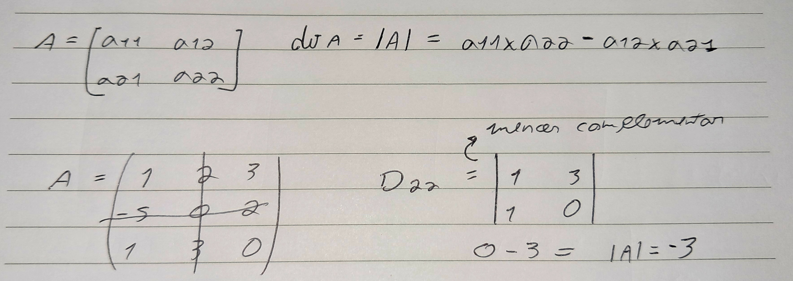
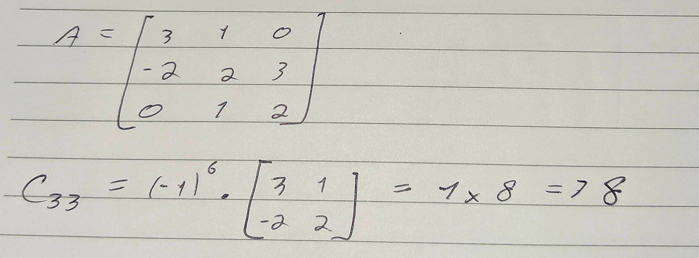
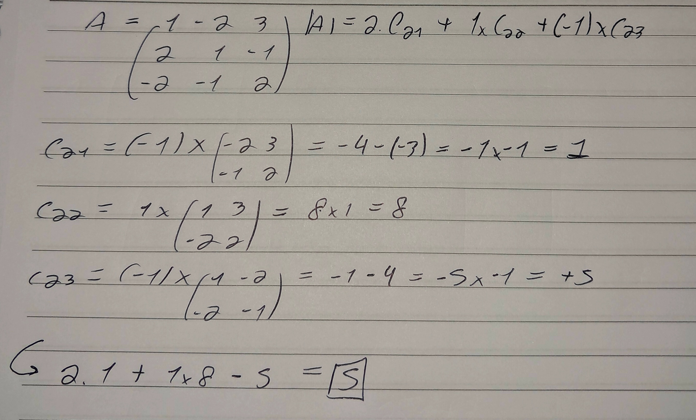

#Concluded 

---
### 1. Determinante

Geometricamente, o determinante é um **fator de escala**. Ele diz o quanto uma transformação "estica" ou "encolhe" uma área ou volume.

Imagine um quadrado de área **1**. Se você aplicar uma matriz nesse e o determinante dela for **4**, esse quadrado vai se transformar em uma forma com 4 vezes a area original

- $\det > 1$: O espaço expandiu.    
- $0 < \det < 1$: O espaço contraiu.
- $\det = 0$: O espaço perdeu uma dimensão.
- $\det < 0$: O espaço foi espelhado e escalonado.

>[!note]
Para que o conceito de "escala de espaço" faça sentido, você precisa transformar o espaço para a mesma dimensão.
> - Uma matriz $2 \times 2$ transforma um plano ($2D$) em outro plano ($2D$). 
> - Uma matriz $3 \times 3$ transforma o espaço ($3D$) em outro espaço ($3D$). 
>  
>Por isso o determinante só existe para matrizes quadradas ($n \times n$).

O determinante de uma matriz quadrada $A_{n*n}$ é um número definido da seguinte forma:
1. Se n=1, $det A$ é a entrada.
2. Se n=2:
	
3. Para n >=3 usamos o desenvolvimento de laplace.

---
### **2. Desenvolvimento de laplace**

O **menor complementar** de um elemento de uma matriz quadrada é o determinanate dela, eliminando-se a linha e a coluna do elemento.
	

**Cofator**: $C_{ij} = (-1)^{i+j} \cdot D_{ij}$
	

Segundo o desenvolvimento de laplace, para descobrir o determinante, você escolhe uma linha ou coluna qualquer. O determinante será a soma entre cada elemento multiplicado pelo seu cofator.
	
