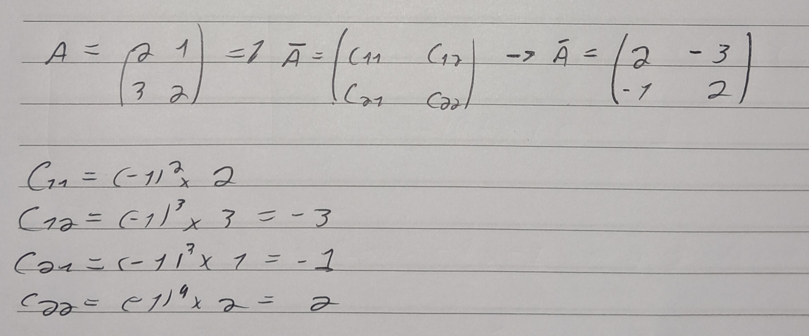
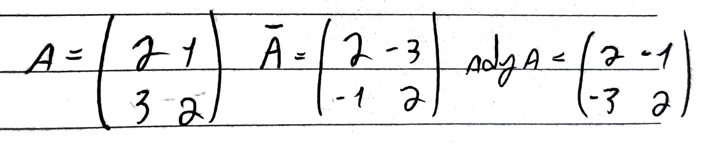
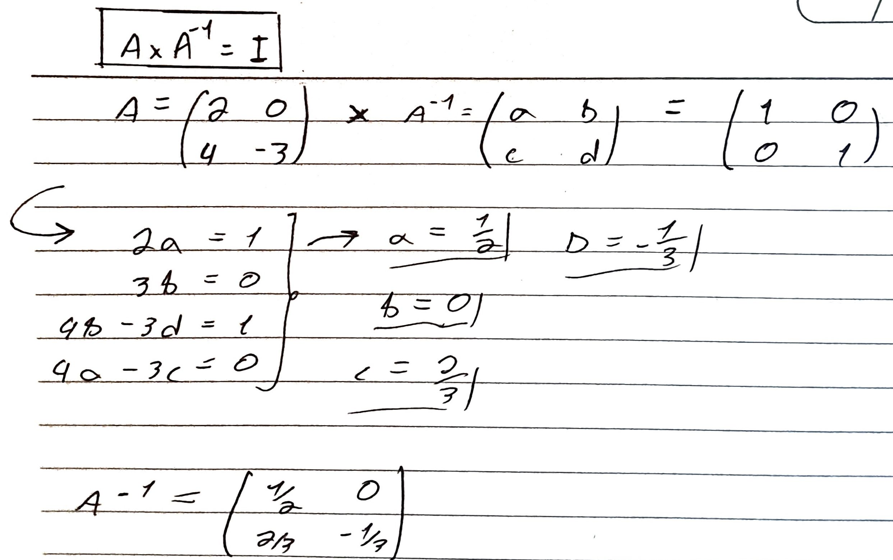

#Concluded 

---

**Matriz dos cofatores:** é a matriz cujas entradas são os cofatores da matriz A.
	

**Matriz adjunta:** é a transposta da matriz dos cofatores.
	

---
**Matriz inversa:**  Seja $A$ uma matriz quadrada. Sua inversa, caso exista, será $A^{-1}$, tal que:
	$A^{-1}*A = A*A^{-1 } = I$

1. Se A é invertivel, então $\det A \neq 0$ e $\det A^{-1} = \frac{1}{\det A}$

---
**Matriz ortonormal:** Uma matriz é considerada ortonormal quando suas colunas são vetores que satisfazem duas condições simultaneamente:

1. **São Ortogonais entre si:** O produto escalar entre qualquer par de colunas diferentes é zero (formam um ângulo de 90°).
2. **São Normalizados:** O módulo de cada coluna é exatamente 1.

A característica mais incrível de uma matriz ortonormal $A$ é que sua **transposta** é igual à sua **inversa**.
$$A^T = A^{-1}$$

