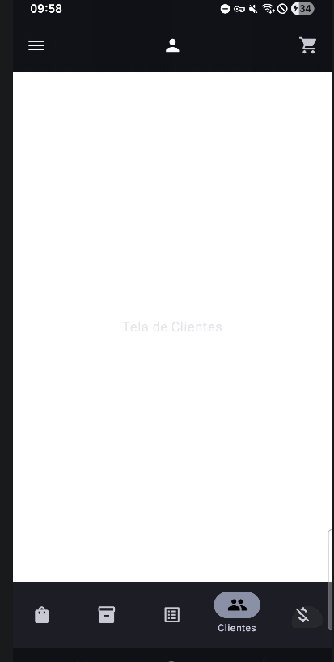

#Concluded

---
É recomendado criar arquivos Kotlin separados para cada tela.

**MainActivity*

**navController**: detentor de estado centralizado da navegação. Ele é o único objeto que realmente sabe em qual tela o usuário está. Ele gerencia uma pilha, cada vez que você navega, ele empilha um nó no objeto de contexto.

A função ScreenStructure é o "cérebro" da interface. Ela utiliza o padrão de **State Hoisting** para gerenciar três sistemas complexos: o menu lateral, a barra de navegação e o conteúdo central.

**Gerenciamento de Estado**
- **drawerState**: Controla se o menu lateral está aberto ou fechado. 
- **scope = rememberCoroutineScope()**: Operações como abrir ou fechar o menu são animações que levam tempo. Você precisa de um escopo de corrotina para dispará-las de dentro de cliques de botões comuns.
- **currentRoute**: Sempre que a tela muda, o currentBackStackEntryAsState avisa o Compose, permitindo que o menu ou a barra saibam qual item deve ser destacado.

**ModalNavigationDrawer**: Ele decide o que aparece por cima do conteúdo principal.
- **drawerContent**: Aqui você define o que está dentro do menu. 
- **onItemClick**:Quando você clica em um item do menu, três coisas acontecem:
    1. **navController.navigate**: O comando de mudança de tela é enviado.
    2. **popUpTo / launchSingleTop**: Essas configurações evitam que o aplicativo crie uma pilha infinita de telas. Se o usuário clicar várias vezes em "Venda", o sistema não abrirá a mesma tela várias vezes.
    3. **scope.launch { drawerState.close() }**: O menu não fecha sozinho por padrão. Você precisa instruí-lo a fechar animadamente.

**NavHost**:
- Ele cria internamento um grafo de cenas
- Ele atua como um observador. Ele fica "escutando" as mudanças no NavController. 
- Ele é responsável por criar e destruir o Lifecycle de cada tela. 
- É preciso registrar as telas.
- É preciso ter um nó inicial. Por padrão, o sistema de navegação do Android tenta manter esse nó na base da pilha.

**NavGraph**: Telas registradas.
- **Registro de Destinos:** Cada função composable("rota") registra um vértice.
- **Arestas** do grafo são operações de transição de estado. A aresta existe no momento da execução do comando `navController.navigate("rota")`.
- **Propriedades da Aresta:** Você pode configurar propriedades na transição, como:
    - **Animações:** `enterTransition` e `exitTransition`.
    - **launchSingleTop**: Este parâmetro evita duplicatas  de tela na árvore em caso de erro de logica ou duplo clique no topo da pilha
    - **popUpTo**: Remove vértices intermediários durante a transição. Pense em um fluxo de Login: `Login` -> `Cadastro`. Quando o usuário finaliza o cadastro e vai para a `Home`, você não quer que ele consiga voltar para a tela de `Cadastro` ou `Login`.

**Injeção de dependência:** A MainPage não cria o controlador; ela o recebe da MainActivity. Isso permite que a tela dispare eventos de navegação sem precisar saber como o Grafo de Navegação foi construído. Ela apenas dá a ordem, e o `NavController` (que tem a visão global da pilha) a executa.
**navigate**: Está sendo usando uma Template String para montar uma URL dinâmica.

