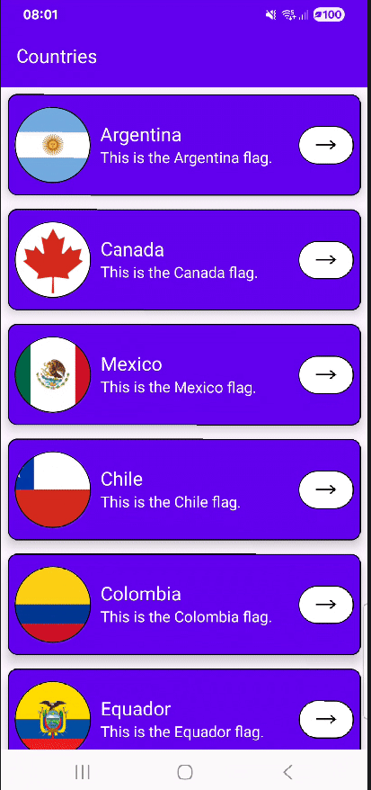

#Concluded 

---

### **1. Lazy Colum** 

A LazyColumn é um componente de lista vertical que utiliza um algoritmo de virtualização para renderizar apenas os itens visíveis na tela. Diferente de uma coluna comum, ela não carrega todos os dados na memória de uma vez. À medida que o usuário realiza o scroll, os itens que saem da área de visão são descartados e os novos são compostos em tempo real. Isso otimiza o uso de CPU e RAM, permitindo a exibição de milhares de registros sem comprometer a fluidez da interface.

**Exemplo**

- Foi usado o **mutableStateListOf** para caso a lista for alterada o Compose dispara uma recomposição na interface.
- O **remember** garante que a lista não seja reinicializada toda vez que a função for executada novamente.

**FirstPage**

- **TopAppBarDefaults.pinnedScrollBehavior()**: Esta função cria um comportamento onde a topbar fica fixa, mas ela sabe quando o conteúdo está passando por baixo dela.
- No **Scaffold**, você usa **topBarBehavior.nestedScrollConnection.** Quando o usuário arrasta a lista, o evento de scroll é enviado para o topBarBehavior. 
- **scrolledContainerColor**: Quando o sensor de scroll detecta que a lista não está no t
- **items(count = countryList.size)**: É um iterador. Para cada índice, ele cria o card.

---
### **2. Card**

Ele delimita um espaço na interface para um conjunto de componentes (imagem, texto e botão), tratando-os como uma unidade lógica.

Ao definir onClick o Card deixa de ser apenas um elemento visual e passa a se comportar como um Surface Clicável. Ele gerencia internamente o efeito ondulação e o feedback visual de toque.

 **elevation**: Define a posição do componente no eixo Z. O sistema calcula a difusão da sombra com base no valor de densidade de pixels para simular profundidade.

**SecondPage**

