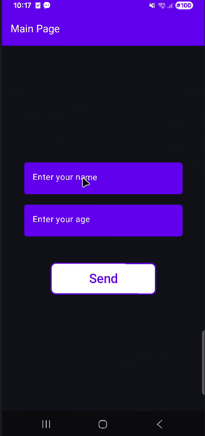

#Concluded

---
É recomendado criar arquivos Kotlin separados para cada tela.

**MainActivity**

**navController**: é o detentor de estado centralizado da navegação. Ele é o único objeto que realmente sabe "onde o usuário está".
- **Gerenciamento de Pilha:** Ele gerencia uma pilha, cada vez que você navega, ele empilha um nobo objeto de contexto. Ele que lida com a troca de activitys
    
**NavHost** não é apenas um "container".
- Ele cria internamento um grafo de cenas
- Ele atua como um observador. Ele fica "escutando" as mudanças no NavController. 
- Ele é responsável por criar e destruir o `Lifecycle` de cada tela. 
- É preciso registrar as telas.
- É preciso ter um nó inicial. Por padrão, o sistema de navegação do Android tenta manter esse nó na base da pilha. Se o usuário apertar "voltar" o app fecha, pois não há mais estados para retroceder.

**NavGraph**: Nos/telas registradas.
- **Registro de Destinos:** Cada função `composable("rota")` registra um vértice.
- **Arestas** do grafo são operações de transição de estado. A aresta existe no momento da execução do comando `navController.navigate("rota")`.
- **Adjacência:** No seu `NavHost`, todos os destinos definidos dentro do mesmo bloco são, por padrão, adjacentes entre si. Isso significa que, teoricamente, qualquer tela pode navegar para qualquer outra, desde que possua a referência do `NavController`.
- **Propriedades da Aresta:** Você pode configurar propriedades na transição, como:
    - **Animações:** `enterTransition` e `exitTransition`.
    - **launchSingleTop**: Este parâmetro evita duplicatas  de tela na árvore em caso de erro de logica ou duplo clique no topo da pilha
    - **popUpTo**: Remove vértices intermediários durante a transição. Pense em um fluxo de Login: `Login` -> `Cadastro`. Quando o usuário finaliza o cadastro e vai para a `Home`, você não quer que ele consiga voltar para a tela de `Cadastro` ou `Login`.

**MainPage**

**Injeção de dependência:** A MainPage não cria o controlador; ela o recebe da MainActivity. Isso permite que a tela dispare eventos de navegação sem precisar saber como o Grafo de Navegação foi construído. Ela apenas dá a ordem, e o `NavController` (que tem a visão global da pilha) a executa.
**navigate**: Está sendo usando uma Template String para montar uma URL dinâmica.

**SecondPage**

**popBackStack**: NavController identifica a tela atual, a fecha e volta para a anterior.
**Icons.AutoMirrored.Filled.ArrowBack**: Esta é uma escolha técnica importante para internacionalização. O "AutoMirrored" garante que, em sistemas de escrita da direita para a esquerda (como o árabe), a seta aponte automaticamente para o lado correto.
