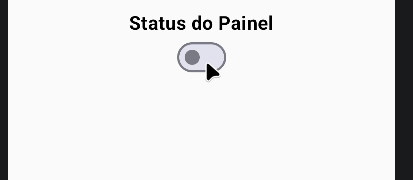
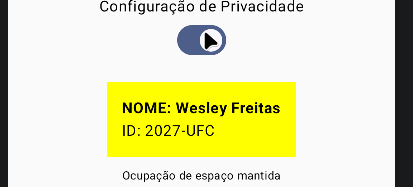

#Concluded 

---
O Switch é um componente de seleção binária. Ele é composto fundamentalmente por dois parâmetros obrigatórios:
- **checked:** Um booleano que define o estado visual atual do componente na interface.
- **onCheckedChange:** Uma função de retorno (callback) que é disparada quando o usuário interage com o interruptor, devolvendo o novo valor booleano.

Para que o switch funcione dinamicamente, é necessário criar uma variável de estado 

**Exemplo remoção condicional:** A limitação é que quando o componente é removido, os elementos abaixo dele "sobem" para ocupar o espaço vazio, alterando o layout.

**Propriedade Alpha:** Em vez de remover o componente, utiliza-se o modificador. O componente continua existindo no layout e ocupando seu espaço original.

## 6