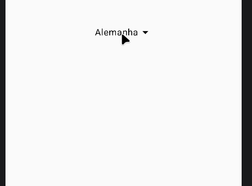

#Concluded 

---

O componente permite que o usuário selecione um item de uma lista suspensa para realizar ações ou preencher campos. O menu não é um componente único, mas uma combinação de elementos que trabalham juntos:

- **Box:** Utilizado como contêiner principal.
- **Row/Text/Image:** Servem como o "gatilho" visual que o usuário clica para abrir a lista.
- **DropDownMenu:** O componente que contém a lista suspensa.
- **DropdownMenuItem:** Cada opção individual dentro do menu.

O componente depende de dois estados principais para funcionar:
- **expanded (Boolean):** Controla a visibilidade do menu.
- **onDismissRequest:** Um _callback_ acionado quando o usuário clica fora do menu ou pressiona o botão voltar. 

- **Rolagem Automática:** Se a lista for muito longa, o DropdownMenu cria automaticamente uma barra de rolagem interna.
