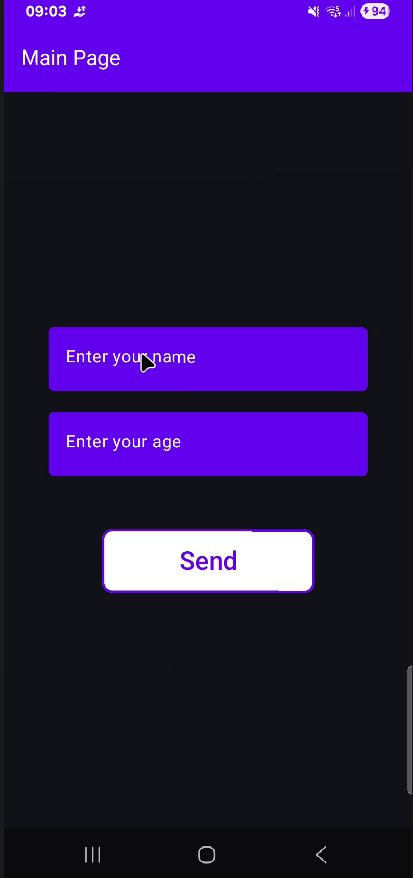

---

É recomendado criar arquivos Kotlin separados para cada tela.


**MainPage**




## Parte 5: Passagem de Dados entre Telas

Atualmente, sua `SecondPage` exibe "David" e "25" de forma estática. O objetivo é enviar o que foi digitado nos `TextFields` da `MainPage` para a `SecondPage`. No Navigation Compose, fazemos isso via **URL-based Routing**.

## 1. Alterando a Rota no NavHost

Precisamos avisar ao Grafo de Navegação que a rota `segunda_tela` agora espera argumentos. Usamos uma sintaxe semelhante a caminhos de diretório ou URLs: `rota/{argumento}`.

**No seu arquivo MainActivity (AppNavigation):**

Kotlin

```
composable(
    // Definimos que a rota aceita dois parâmetros
    route = "segunda_tela/{userName}/{userAge}" 
) { backStackEntry ->
    // Extraímos os dados que chegaram na "mala" (backStackEntry)
    val name = backStackEntry.arguments?.getString("userName") ?: "No Name"
    val age = backStackEntry.arguments?.getString("userAge") ?: "0"

    // Passamos esses valores para a SecondPage através de parâmetros comuns
    SecondPage(navController, name, age)
}
```

---

## 2. Disparando os Dados na MainPage

Agora, ao clicar no botão "Send", você não vai apenas para "segunda_tela". Você vai concatenar os valores das variáveis de estado na String da rota.

**No arquivo MainPage.kt (no onClick do Button):**

Kotlin

```
Button(
    onClick = {
        val name = username.value
        val age = userAge.value
        // Enviamos os dados dentro da string da rota
        navController.navigate("segunda_tela/$name/$age")
    }
)
```

---

## 3. Recebendo e Exibindo na SecondPage

A `SecondPage` agora precisa ser preparada para receber essas Strings e mostrá-las nos componentes de `Text`.

**No arquivo SecondPage.kt:**

Kotlin

```
@Composable
fun SecondPage(
    navController: NavController, 
    name: String, // Novo parâmetro
    age: String   // Novo parâmetro
) {
    // ... dentro da Column do Scaffold ...
    Text(text = "Name: $name", fontSize = 24.sp)
    Spacer(modifier = Modifier.height(10.dp))
    Text(text = "Age: $age", fontSize = 24.sp)
}
```

---

## Detalhes Formais para sua Formação (CC):

- **NavBackStackEntry**: É a classe que representa a entrada atual na pilha de navegação. Ela funciona como um "bundle" (sacola) que carrega os metadados da transição.
    
- **Safe Args vs String Routes**: Embora existam formas de passar objetos complexos, o Google recomenda passar apenas tipos primitivos (Strings, Ints) via rota. Se precisar de dados complexos, o ideal é passar um ID e buscar o objeto em um banco de dados ou ViewModel na tela de destino.
    
- **Null Safety**: Note o uso do operador elvis `?:` no `getString`. Como os argumentos podem tecnicamente ser nulos se a rota for mal formatada, sempre provemos um valor padrão (_fallback_).
