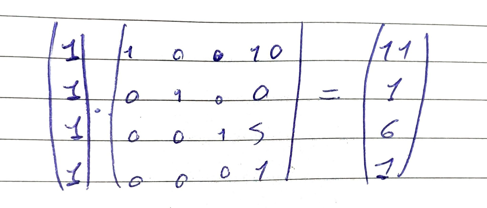

#Concluded 

---
As transformações lineares em 3D são funções matemáticas que mapeiam um vetor de entrada $(x, y, z)$ para um novo vetor de saída $(x', y', z')$.

Toda transformação linear pode ser representada por uma **Matriz de Transformação**. Em 3D, usamos matrizes $3 \times 3$ (ou $4 \times 4$ para coordenadas homogêneas).

### **1. Translatar**

Transladar um ponto significa somar um deslocamento: $x' = x + t_x$. As outras transformações (escala, rotação, cisalhamento) são multiplicações. Se você mantiver o 3D puro, não consegue combinar o movimento com o giro em uma única matriz. Você teria que multiplicar para girar e depois somar para mover, o que impede a otimização em massa que as GPUs fazem.

Para transformar a soma em uma multiplicação, "fingimos" que o nosso mundo 3D existe dentro de um espaço 4D. 

 Imagine que você quer mover um ponto do seu objeto por 10 unidades em X e 5 em Z.

Agora que a translação é uma matriz $4 \times 4$, você pode fazer isso aqui no seu código:

$$M_{final} = M_{translacao} \cdot M_{rotacao} \cdot M_{escala}$$

O resultado é uma única matriz $4 \times 4$ que, ao ser multiplicada por um ponto, **muda o tamanho, gira e move o objeto para o lugar certo de uma vez só**. 

---
### **2. Escala**

A escala altera o tamanho do objeto. Ela multiplica cada componente do vetor por um fator de escala $s$.

- Se $s_x = 2$, o objeto dobra de largura. Se for $0.5$, ele reduz pela metade. Se os fatores forem diferentes, você "estica" o objeto em direções específicas.
	

---
### **3. Rotação**

A rotação em 3D é mais complexa que em 2D porque você precisa definir um **eixo de rotação**. As matrizes mudam dependendo de qual eixo o objeto gira:

 

---
### **4. Reflexão**

A reflexão inverte o objeto em relação a um plano (como um espelho).

---
### **5. Cisalhamento**

Existem 6 matrizes de cisalhemento 3D:

