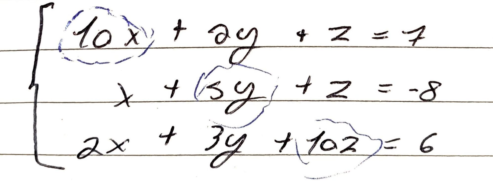
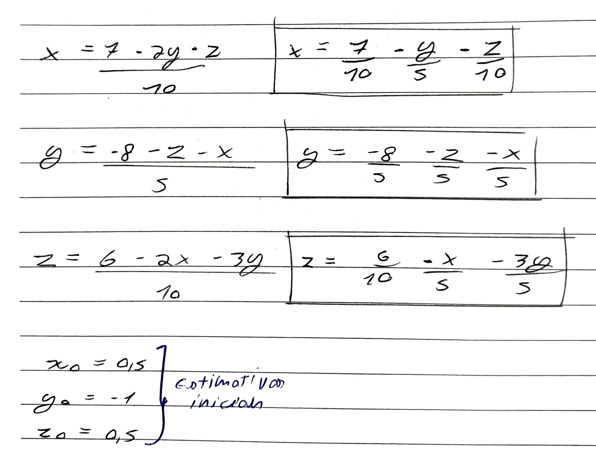
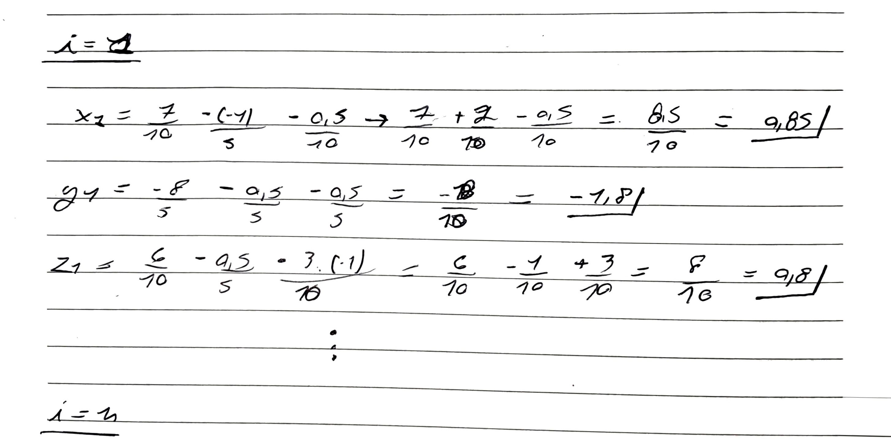
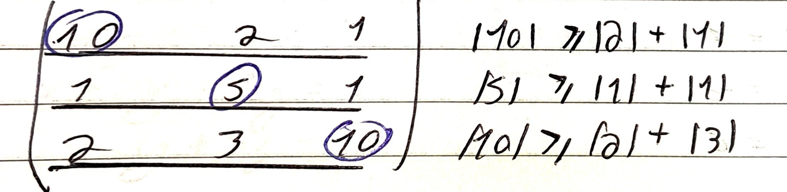

#Concluded 

---

O Método de Jacobi é um algoritmo usado para resolver sistemas de equações lineares. O método de Jacobi é um método **iterativo**. 

Dado o sistema de equação linear abaixo:

Selecione os termos da diagonal principal e isole cada incógnita em uma das equações.     

Dê estimativas iniciais para cada icógnita e começe as iterações. Na iteração atual ($i+1$), você usa apenas os valores da iteração anterior ($i$). 

**Critério de convergência:** Esse método nem sempre chega em um resultado; às vezes os números começam a crescer até o infinito (divergência). 

O método é garantido se a matriz for **diagonal dominante**, ou seja, o valor absoluto do número na diagonal principal **deve ser maior ou igual** que a soma dos outros valores daquela linha. Mas pelo menos uma das linhas deve ter o valor da diagonal principal maior que a soma dos outros elementos da linha.

Quando a matriz dos coeficientes **não é diagonal dominante**. Nada podemos concluir com relação a convergência. Mas, você pode utilizar a troca de linha de matriz para tentar tornala diagonal dominante.

**Critério do Erro Relativo**

$$\frac{\max |x_i^{(k+1)} - x_i^{(k)}|}{\max |x_i^{(k+1)}|} < \epsilon$$

> **Tradução para o "Dev":** Se o resultado quase não mudou da rodada $k$ para a $k+1$, significa que o valor convergiu e você já está perto o suficiente da resposta real.

**Critério do Número Máximo de Iterações**: Como garantia de segurança você sempre deve definir um limite máximo de loops (ex: 1000 iterações).

## 1. O Filtro de Entrada: Permutação de Linhas

Antes de o loop começar, seu código deve analisar a matriz.

- **Ação:** Verifique se os maiores valores de cada linha estão na diagonal principal. Se não estiverem, troque as linhas.
    
- **Por que:** Isso aumenta drasticamente a chance de convergência e evita divisões por números muito pequenos (que geram erros de precisão no computador).
    

---

## 2. O Critério de Parada "Duplo Check"

Combine o **Erro Relativo** com o **Cálculo do Resíduo**. É a forma mais segura de garantir que o loop pare no momento certo.

## A. Erro Relativo (Estabilidade)

Ele verifica se o algoritmo "estacionou".

$$\text{ErroRel} = \frac{\max |x_i^{(k+1)} - x_i^{(k)}|}{\max |x_i^{(k+1)}|}$$

## B. Norma do Resíduo (Precisão Real)

Este é o mais importante. Ele verifica se o $x$ encontrado realmente resolve a equação $Ax = b$.

$$\text{Resíduo} = \| b - A \cdot x^{(k+1)} \|$$

- **Como funciona:** Se você multiplicar a matriz $A$ pelo seu resultado $x$, o valor deve ser quase igual a $b$. Se a diferença for quase zero, você atingiu a precisão.
    
