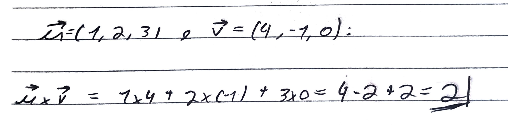
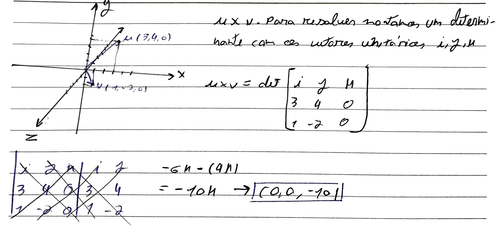
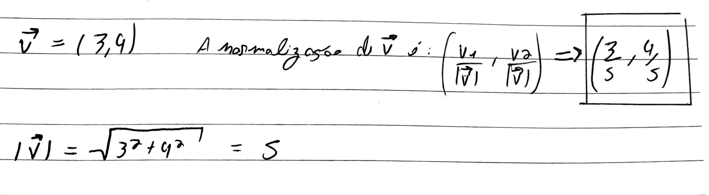
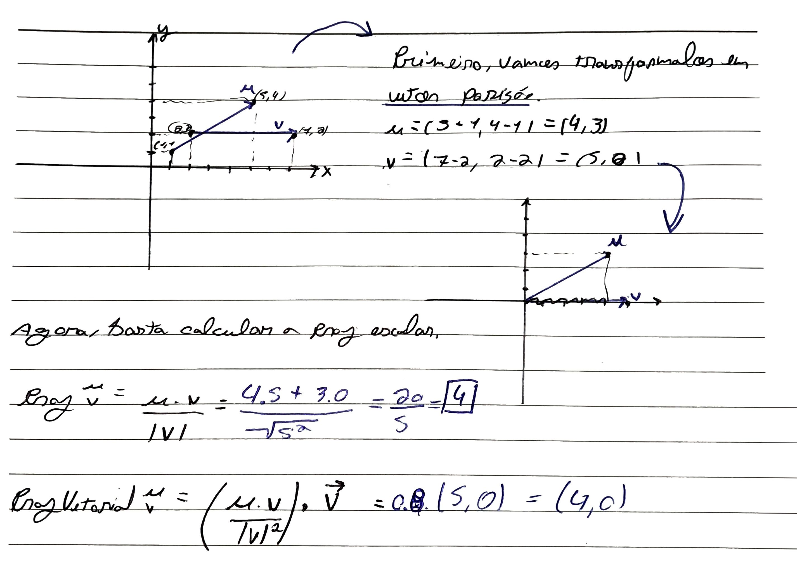

#Concluded 

---
### **1. Vetor**

Geometricamente, um vetor é uma **seta** que possui três características fundamentais:
- **Módulo/Magnitude:** O "tamanho" da seta.
- **Direção**
- **Sentido:** Para onde a ponta da seta aponta.

Diferente de um ponto (que é apenas uma localização), o vetor representa um deslocamento ou uma força.

**Duas dimensões $R²$**

**Três dimensões $R³$**

**Vetores opostos** são vetores mesma direção, mesmo módulo mas com sentidos diferentes.
$a = (1,2,3)$ e $b = (-1,-2,-3)$

- **Ponto - Ponto = Vetor** (Distância e direção entre dois lugares).
- **Ponto + Vetor = Ponto** (Você está em um lugar e se desloca para outro).
- **Vetor + Vetor = Vetor** (Dois deslocamentos seguidos)

---
### **2. Soma de vetores**

---
### **3. Produto escalar**

O resultado é um **número único**. 
- **A Fórmula:** $\vec{a} \cdot \vec{b} = |\vec{a}| |\vec{b}| \cos(\theta)$
- **Em coordenadas:** $(a_1 \cdot b_1) + (a_2 \cdot b_2) + (a_3 \cdot b_3)$

O valor do produto escalar revela a relação angular entre os vetores:
- **Positivo** $0^\circ \leq \theta < 90^\circ$. Ângulo agudo.
- **Zero** $\theta = 90^\circ$ Ortogonais/perpendiculares.
- **Negativo** $90^\circ < \theta \leq 180^\circ$ ângulo obtuso

---
### **4. Produto Vetorial**

O resultado é um **novo vetor**. Esse novo vetor é especial porque ele é **perpendicular (90°)** aos dois vetores originais ao mesmo tempo. É exclusivo do espaço 3D.

- **A Fórmula:** $|\vec{a} \times \vec{b}| = |\vec{a}| |\vec{b}| \sin(\theta)$    
- **Direção:** Segue a "Regra da Mão Direita".

Vamos usar os vetores:
- $\vec{A} = (3, 4, 0)$
- $\vec{B} = (1, -2, 0)$

---
### **5. Multiplicação por um escalar**

Se $k = 3$ e $\vec{v} = (1, -2, 4)$:
$$3 \cdot \vec{v} = (3 \times 1, 3 \times -2, 3 \times 4) = (3, -6, 12)$$

Quando você multiplica um vetor por um escalar, o efeito visual depende do valor de $k$:
- **Se $k > 1$:** O vetor mantém a direção, mas aumenta o comprimento.
- **Se $0 < k < 1$:** O vetor mantém a direção, mas diminui o comprimento.
- **Se $k = -1$:** O vetor mantém o tamanho, mas inverte o sentido.
- **Se $k = 0$:** O vetor vira o vetor nulo.

---
### **6. Módulo de um vetor**

O módulo/normade um vetor é o seu comprimento ou magnitude. Representamos o módulo de um vetor $\vec{v}$ como $\|\vec{v}\|$ ou $|\vec{v}|$.

A lógica para calcular o tamanho de um vetor é a mesma do Teorema de Pitágoras. Se você tem um vetor no espaço 3D $\vec{v} = (x, y, z)$, o módulo é a raiz quadrada da soma dos quadrados de suas componentes:
$$\|\vec{v}\| = \sqrt{x^2 + y^2 + z^2}$$

Se você tem um vetor $\vec{v} = (3, -4, 0)$:
$$\|\vec{v}\| = \sqrt{3^2 + (-4)^2 + 0^2}$$
$$\|\vec{v}\| = \sqrt{9 + 16 + 0} = \sqrt{25} = 5$$

---
### **7. Normalização**

Normalizar um vetor significa transformá-lo em um **vetor unitário**, ou seja, um vetor que mantém a mesma direção e sentido do original, mas cujo módulo é exatamente 1.

---
### **8. Projeção escalar e vetorial**

A **projeção escalar** representa o **comprimento** da sombra de $\vec{u}$ sobre a direção de $\vec{v}$.
$$Proj_{\vec{v}}\vec{u} = \frac{\vec{u} \cdot \vec{v}}{|\vec{v}|}$$

A **projeção vetorial** é um vetor. É a sombra propriamente dita, com direção e sentido. Ela pega o comprimento (projeção escalar) e o transforma em um vetor que "mora" em cima da linha de $\vec{v}$
$$proj_{\vec{v}}\vec{u} = \left( \frac{\vec{u} \cdot \vec{v}}{|\vec{v}|^2} \right) \vec{v}$$    

---
### **9. Vetor normal**

Dizemos que um vetor é Normal a uma superfície (como um plano) quando ele é **perpendicular** a essa superfície.

Encontrar a normal significa descobrir para qual direção uma face está "olhando". Na computação, as superfícies são feitas de triângulos. Para o computador saber qual é a "frente" e qual é a "costa" desse triângulo, ele calcula a normal.

Se você tem três pontos ($p_0, p_1, p_2$):

1. Cria dois vetores: $\vec{A} = (p_1 - p_0)$ e $\vec{B} = (p_2 - p_0)$.
    
2. Produto Vetorial: $\vec{n} = \vec{A} \times \vec{B}$.
    
3. O resultado $\vec{n}$ é a **Normal**.
