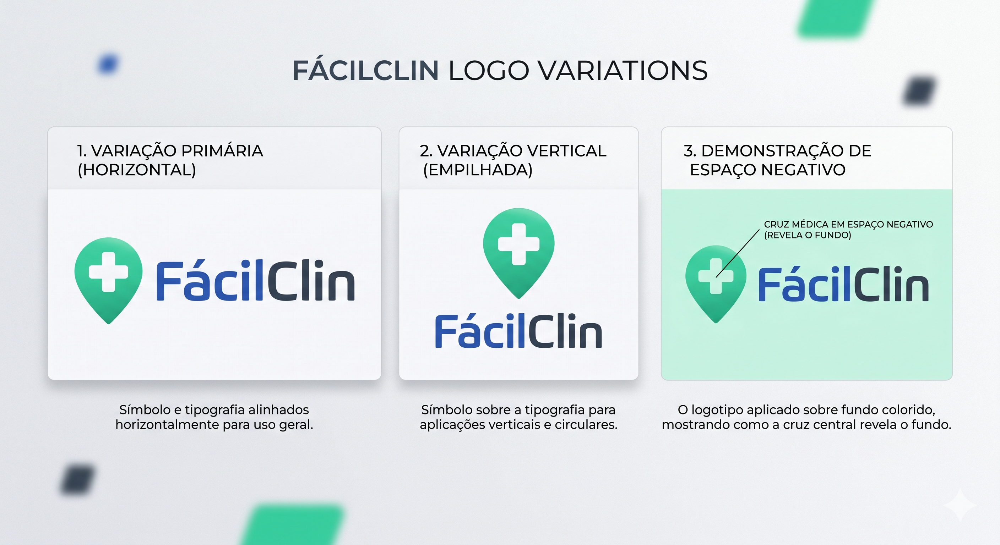

O projeto visa desenvolver um aplicativo que conecte pacientes a clínicas ou laboratórios. O foco principal é eliminar a dificuldade de busca e comparação de serviços (consultas e exames), reduzindo o tempo entre a necessidade do paciente e o contato efetivo com o prestador de serviço.

A jornada atual do paciente é fragmentada. Para realizar um procedimento, o usuário precisa buscar clínicas individualmente, muitas vezes sem acesso prévio a preços, localização exata ou catálogo de serviços. Isso resulta em perda de tempo, impossibilidade de comparação financeira e sobrecarga nas recepções das clínicas com dúvidas básicas.

#### **Módulo do Paciente**
- **Busca e Filtragem:** Ferramenta de pesquisa por nome da clínica, especialidade médica ou tipo de exame.
- **Geolocalização:** Filtro para exibição de clínicas por proximidade geográfica (distância).
- **Vitrine de Serviços:** Visualização de catálogo de serviços com preços e fotos da infraestrutura.
- **Sistema de Avaliação:** Notas e comentários de 1 a 5 estrelas.
- **Redirecionamento Estruturado:** Botão de agendamento que envia o usuário ao WhatsApp da clínica com uma mensagem pré-formatada. 
#### **Módulo da Clínica 
- **Gestão de Perfil:** Painel para edição de horários, fotos, localização e corpo clínico.
- **Catálogo de Serviços:** Cadastro e atualização de consultas e exames oferecidos com seus respectivos valores.
#### **Limites do Projeto**
- **Processamento de Pagamento:** O pagamento não ocorre dentro do app; fica sob total responsabilidade da clínica.
- **Agendamento direto com a clínica:** O app não fará a reserva direta de horários; ele facilita a chegada do paciente ao canal de atendimento onde o horário será definido.

---

Essa ideia é altamente escalável. Ele resolve o problema de qualquer setor onde o cliente precisa de informações específicas (preço e disponibilidade) antes de fechar o serviço.

Setores que se encaixaria: 
1. Setor de serviços automotivos(troca de óleo, alinhamento, pintura)
2. Pet shop e veterinárias(Agendamento de banho e tosa ou consultas veterinárias)
3. Serviços estéticos (Barbearias, salões de beleza e estúdios de tatuagem).
4. Aluguel de espaços (Quadras de esportes, salões).

- **Baixa Responsabilidade Jurídica:** Como você não processa o pagamento e não guarda nada.
- **Fácil Implementação**
- **Manutenção Simples:** Você foca na experiência de busca e filtros, sem precisar gerenciar sistemas complexos de checkout ou logística.
