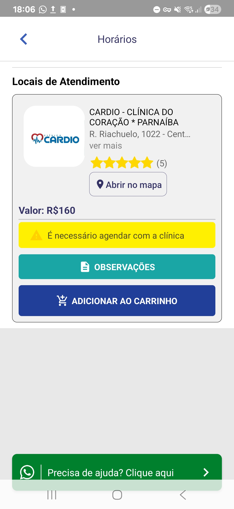
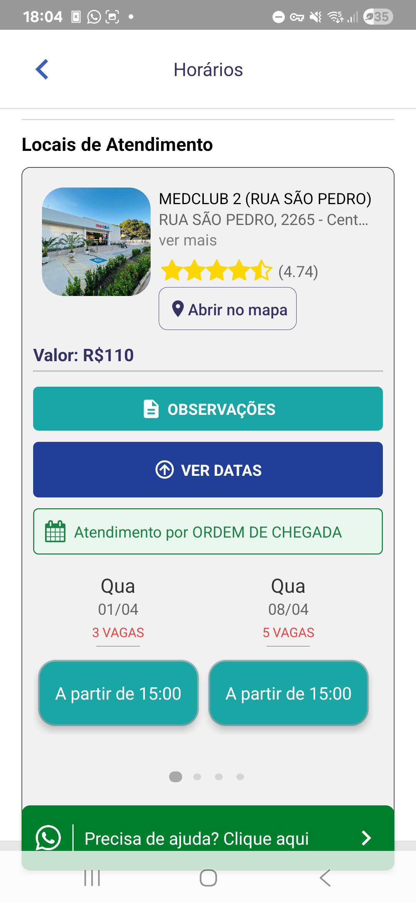

---

- Consulta, exames (loboratorial e de imagem).
- O mvp não vai considerar Convênio?

## **Módulo do Paciente**
### **[RF01] Buscar Clínicas e Especialidades**

**Descrição:** Como Paciente, quero pesquisar por especialidades(dentista, oftamologista...), procedimentos ou nomes de clínicas para encontrar o atendimento necessário.

**Fluxo Principal:**
1. Usuário acessa a barra de busca na tela inicial.
2. Digita o termo de busca (ex: "Cardiologia" ou "Exame de Sangue").
3. O sistema utiliza a **geolocalização** para filtrar resultados próximos.
4. O sistema exibe uma lista de clínicas e distância.
    
**Fluxos Alternativos:**    
- FA01: Geolocalização desativada (O sistema solicita a inserção do CEP ou cidade).
    
**Mensagens do Sistema:**
- MSG01: "Nenhum prestador encontrado nesta região."
    
**Critérios de Aceitação:** A busca deve retornar os resultados podendo filtrar por preço.

### **[RF02] Agendar Consulta/Exame**

**Descrição:** Como Paciente, quero selecionar um horário disponível na agenda de uma clínica para realizar o agendamento.

**Fluxo Principal:**
1. Usuário seleciona uma clínica/profissional.
2. Visualiza o calendário de horários disponíveis...
3. Confirma os dados do paciente (Próprio ou Dependente).
4. Finaliza o agendamento.    
### **[RF03] Pagamento Online**

**Descrição:** Como Paciente, quero pagar pela consulta via app para garantir a reserva e agilizar o atendimento presencial.

**Fluxo Principal:**
1. Usuário escolhe a forma de pagamento.
2. Insere dados de pagamento.
3. O sistema processa a transação através do gateway.
    
**Fluxos Alternativos:**
- FA01: Pagamento negado (O sistema informa o erro e solicita outra forma).
    
**Mensagens do Sistema:**
- MSG01: "Pagamento confirmado."
    
**Critérios de Aceitação:** O sistema deve gerar um comprovante e enviá-lo.

- Opção de dar feedback para a clínica/profissional

---

## **Módulo da Clínica/Profissional**

- Cadastro na platorma...
- Feedbacks da clinica/profissional
### **[RF04] Gestão de Agenda e Disponibilidade**

**Descrição:** Como Gestor da Clínica, quero configurar os horários de atendimento dos profissionais para que fiquem visíveis no marketplace.

 ...
### **[RF05] Confirmar/Cancelar Agendamento**

**Descrição:** Como Clínica, quero validar os pedidos de agendamento recebidos para organizar o fluxo de pacientes.

**Fluxo Principal:**
1. Usuário recebe notificação de novo agendamento.
2. Acessa "Pedidos Pendentes".
3. Visualiza detalhes (Paciente, Especialidade, Pagamento, hora).
4. Seleciona "Confirmar" ou "Cancelar".
    
**Fluxos Alternativos:**
- FA01: Cancelamento pela clínica (O sistema exige o preenchimento de um motivo e notifica o paciente imediatamente).
    
**Mensagens do Sistema:**
- MSG01: "Agendamento confirmado. O paciente foi notificado."
    
**Critérios de Aceitação:** Se o agendamento for cancelado pela clínica, o estorno financeiro deve ser disparado  caso tenha havido pagamento prévio.

---
## **Módulo Administrativo** 

### **[RF06] Credenciamento de Parceiros**

**Descrição:** Como Administrador, quero validar a documentação de novas clínicas para garantir a segurança da plataforma.

**Fluxo Principal:**
1. Administrador acessa "Solicitações de Cadastro".
2. Analisa o CNPJ, CRM/RQE do responsável.
3. Define o percentual de comissão
4. Aprova o cadastro.
    
**Fluxos Alternativos:**
- FA01: Documentação inválida (O sistema permite enviar uma notificação solicitando correção).
    
**Mensagens do Sistema:**
- MSG01: "Parceiro ativado com sucesso."
    
**Critérios de Aceitação:** A clínica só aparece nos resultados de busca após o status ser alterado para "Ativo".    

### **[RF07] Dashboard Financeiro e Repasse**

**Descrição:** Como Administrador, quero visualizar o volume total de transações e o status dos repasses financeiros.

**Fluxo Principal:**

1. Acessa "Relatórios Financeiros".
2. Filtra por período (Início e Fim).
3. Visualiza: Total Transacionado, Comissões Retidas e Valores a Repassar.
4. Exporta relatório em PDF/CSV.

---
## **Notificações** 
### **[RF08] Notificação Push e Lembretes**

**Descrição:** Como Sistema, quero enviar lembretes automáticos para reduzir o esquecimento.

**Fluxo Principal:**
1. O sistema identifica agendamentos para as próximas 24 horas.
2. Dispara notificação push/SMS para o Paciente.
3. Dispara lembrete para a Clínica